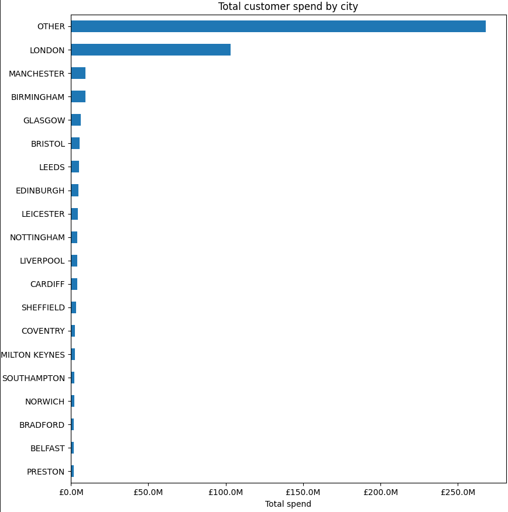

# London to UK

Report on spending volumes for London-based customers versus those based in the
rest of the United Kingdom. This report was created using a result-drive
approach, as described in [Solve Any Data Analysis Problem](https://www.manning.com/books/solve-any-data-analysis-problem).

## 1. Understanding (Describing the problem)

- Which UK cities are currently underserved?
- Are the customers primarily London-based?

## 2. Starting at the End (Describing a Minimum Viable Answer)

### Which UK cities are currently underserved?

This requires us to calculate total customer spend by city and find cities with
the lowest customer spend.

### Are the customers primarily London-based?

This can be answerer from the output of the first answer.

## 3. Identify (Check for sources of data)

### Data Dictionary

| Column      | Definition                                                   |
| :---------- | :----------------------------------------------------------- |
| company_id  | A unique identifier for each customer company in the dataset |
| address     | A single field to store the customers’ address               |
| total_spend | The total amount this customer has spent to date (in GBP)    |

### Describing solution

It's possible to gather customers' cities from `address`, and customers' total
spent in `total_spend`. The `address` is not properly formatted, so it must be
transformed before use.

## 4. Obtain (Get data)

- **[UK List of Cities](https://www.gov.uk/government/publications/list-of-cities/list-of-cities-html)**
- **[Customer Data](https://raw.githubusercontent.com/davidasboth/solve-any-data-analysis-problem/main/chapter-2/data/addresses.csv)**

If using UNIX (for Customer Data):

```bash
curl -o data.csv https://raw.githubusercontent.com/davidasboth/solve-any-data-analysis-problem/main/chapter-2/data/addresses.csv
```

## 5. Do (Hands-on)

Check [this](./main.py).

## 6. Present (Show the results to the stakeholders)



- **Total spent by London customers**: £103M
- **Total spent in the rest of the UK**: £387M
- **Total spent in all major cities outside London**: £119M

### Caveats

- The cities used are only the major ones;
- City `OTHER` may have some unidentified outliers that should belong to some
major city, and if needed, the analysis can be improved further. Although, the
overall result likely won't change.

## 7. Iterate (Repeat from a previous step to make the result better)

- Identify city or town based on postcode
- Use Google Maps API (May raise privacy concerns)
- Augment the data with demographic information for each city or town

### New Problems

- [ ] What do costumers spend figures look like at different levels of granularity?
- [ ] Can you identify business adresses and consider comparing customers with
private adresses versus those with business adresses?
- [ ] Augment your geographic analysis with population figures or other
demographics. Are there any patterns, such as relationship between the wealth of
an area and the amount of customer spend?
